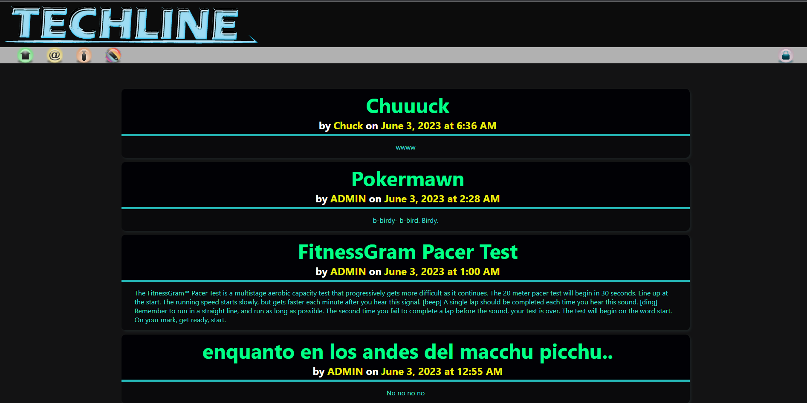

# Tech Blog

This is a front and back end website using node, sql, sequelize, bcrypt, mySQL2, express, and handlebars. It was made to adhere to the MVC paradigm. Users can sign in, make posts, comment on posts, edit their own posts, delete their own posts. 

## Installation

The website is live on Heroku here.
If you want to run it locally download the repo, open bash in the root folder, install the dependencies, source the schema in mySQL, npm start, then connect to localhost:3001.

## Usage

This website displays functional front and back end code to allow you to alter a database from the front end of a website. You can post and comment.

[Github](https://github.com/LaurenWollaston)